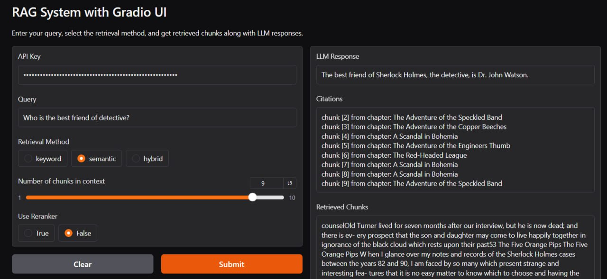
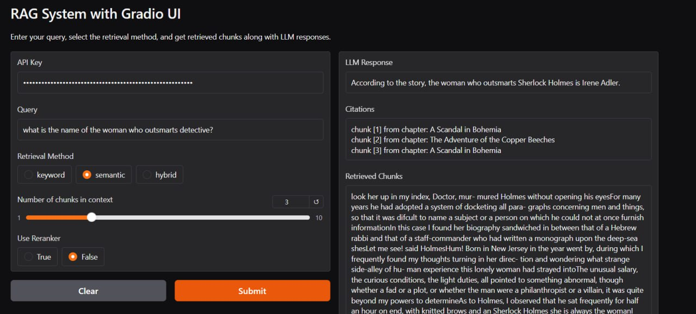
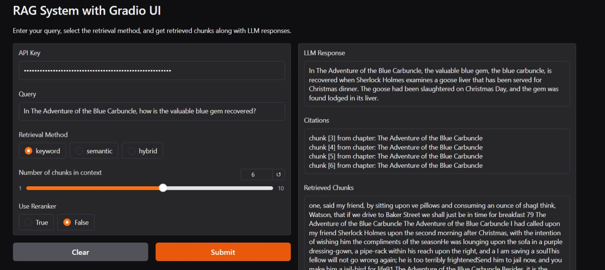

# RAG-Based Sherlock Holmes QA System  

This project is a Retrieval-Augmented Generation (RAG) system designed to answer user queries based on *Sherlock Holmes* books. It retrieves relevant chunks of text corresponding to the user’s query, uses a pre-trained language model (LLama) to generate responses, and displays the retrieved chunks along with citations.  

## Features  

- **Contextual Query Resolution**: Extracts the most relevant text chunks from *Sherlock Holmes* books to address user questions.  
- **Pretrained LLM Integration**: Uses LLama to generate high-quality responses based on the retrieved context.  
- **Customizable Chunk Retrieval**: Allows users to specify the number of text chunks to retrieve for each query.  
- **Reranking for Precision**: Optionally employs a reranker to improve the quality of retrieved chunks.  
- **User-Friendly Interface**: Built with Gradio for an intuitive and interactive user experience.  


## Installation  

To start the system you need to install dependencies:
```
pip install -r requirements.txt
```

Then, RAG system can be launched like this:
```
python3 main.py
```
### OR you can use already deployed app. (Watch usage for public Huggingface link).

## Usage  

1. Open the Gradio interface using link `https://huggingface.co/spaces/DenysPetro/RAG_NLP`.  
2. Enter your `Groq` api key. (If you don't have one,
you can register and generate one at the following link: `https://console.groq.com/keys`)  
3. Enter your query in the input box.
4. Adjust settings (e.g., number of chunks, reranking) if desired.  
5. Get the response, retrieved chunks, and citations.  

## Example Queries  

- *"Who is Sherlock Holmes?"*
- *"Who is the best friend of detective?"* 
- *"What is the name of the woman who outsmarts detective?"*  
- *"What is the relationship between Holmes and Watson?"*  
- *"In The Adventure of the Blue Carbuncle, how is the valuable blue gem recovered?"*  
- *"In "The Adventure of the Engineer's Thumb," who is the main antagonist, and what was his sinister motive?"*

## Project Structure  

```
rag-sherlock-holmes/  
│  
├── data/
│     └── sherlock.pdf      # 11 Chapters of Sherlock Holmes in pdf.
├── assistant.py            # Contains query handling, and returns llm response.
├── citation.py             # Main application script  
├── requirements.txt        # Dependencies  
├── embeddings.py           # Is used for chunking text, creating embeddings.
├── reranker.py             # Contains reranker.
├── retrievers.py           # Contains 3 rerankers: BM25 (keyword), Semantic and Hybrid.
├── text_processing.py      # Contains data extraction and preprocessing.
├── README.md               # Project documentation  
└── app.py                  # Main application script + Gradio UI  
```  

## Example of working project:

**Semantic search with query: `Who is the best friend of detective?`; Number of chunks: 9.**


**Semantic search with query: `What is the name of the woman who outsmarts detective?`; Number of chunks: 3.**


**Keyword search with query: `In The Adventure of the Blue Carbuncle, how is the valuable blue gem recovered?`; Number of chunks: 9.**



## Stack

- **LLM**: `groq/llama3-8b-8192`
- **UI**: `Gradio`
- **Vector DB**: `FAIIS`
- **Embeddings generation model**: `all-MiniLM-L6-v2`
- **Reranker model**: `BAAI/bge-reranker-large`
- **Chunking**: `langchain.text_splitter - RecursiveCharacterTextSplitter`

